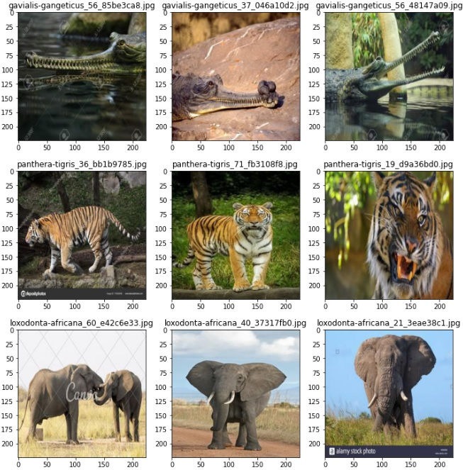
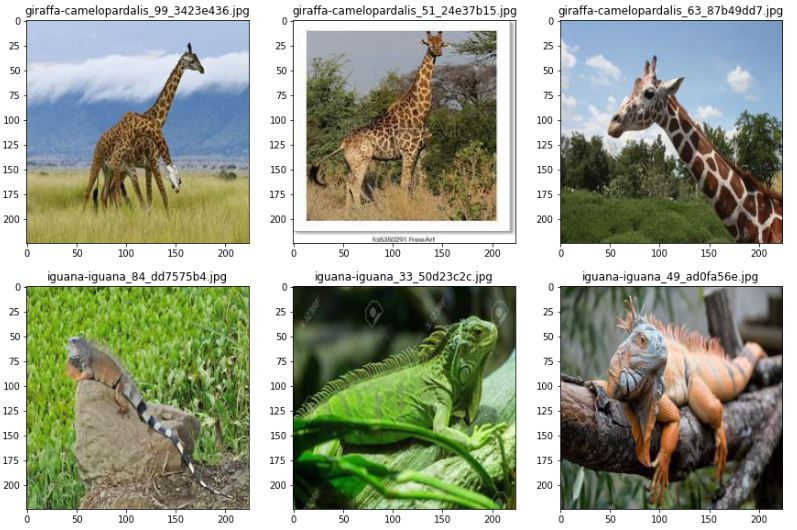
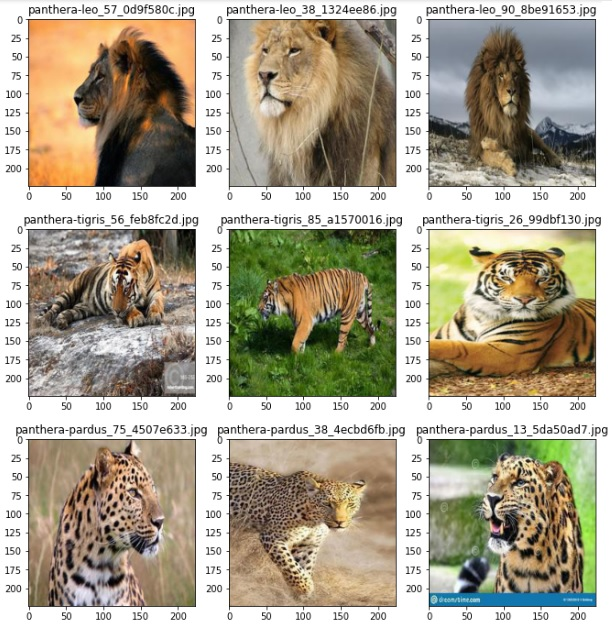

# **Image Classification using Transfer Learning in Neural Networks**

## I. Repository Overview
- This repository contains multiple tutorials that cover building neural network models for image classification using the concept of `Transfer Learning`. Currently 3 tutorial notebooks are available in this repository:
  1. `transfer_learning_multiclass.ipynb`
  2. `transfer_learning_binaryclass.ipynb`
  3. `transfer_learning_bigcats.ipynb`

## II. Tutorial notebooks details

1. **`transfer_learning_multiclass.ipynb`**
   - This tutorial covers developing a neural network model by leveraging `Transfer Learning`, i.e. rather than training a new and very deep CNN from scratch, leverage using publicily avaialble previously trained deep CNN models. In Transfer Learning we combine the architecture and weights of a pre-trained model(`InceptionV3` model, in this case) with a few newly added layers to classify image data. All model development has been done under `Tensorflow` framework.
   - [Animals 151](https://www.kaggle.com/datasets/sharansmenon/animals141) dataset from Kaggle website has been taken for model development. I have purposefully selected images for only 12 animal species : *Elephant,Firefox,Fox,Gavial,Giraffe,Gorilla,Iguana,Leopard,Lion,Macao,Tiger,Wolf*, as model development data.
   - In this notebook, the classification model will be trained to identify all 12 species.  
         
   - Because fewer images were available as training data, `tensorflow.keras.preprocessing.image` module has been used to create augmented images with *Rotation, Shifting, Shearing, Flipping, Zooming* etc transformation applied on training images data.
   - For this model, I have selected `mixed9` layer as the last layer from `InceptionV3 ` model and added a few new layers on top of it to complete model architecure for a new neural network model. 

2. **`transfer_learning_binaryclass.ipynb`**
   - This tutorial covers developing a neural network model by leveraging `Transfer Learning`. All model development has been done under `Tensorflow` framework.
   - [Animals 151](https://www.kaggle.com/datasets/sharansmenon/animals141) dataset from Kaggle website has been taken for model development. I have purposefully selected images for only 12 animal species : *Elephant,Firefox,Fox,Gavial,Giraffe,Gorilla,Iguana,Leopard,Lion,Macao,Tiger,Wolf*, as model development data
   - In this notebook, the classification model will be trained to identify between only **2 randomly selected species**, *Giraffe and Iguana* in this case, out of the 12 species. 
     
   - Because fewer images were available as training data, `tensorflow.keras.preprocessing.image` module has been used to create augmented images with *Rotation, Shifting, Shearing, Flipping, Zooming* etc transformation applied on training images data.
   - For this model, I have selected `mixed7` layer as the last layer from `InceptionV3 ` model and added a few new layers on top of it to complete model architecure for a new neural network model.

3. **`transfer_learning_bigcats.ipynb`**
   - This tutorial covers developing a neural network model by leveraging `Transfer Learning`. All model development has been done under `Tensorflow` framework.
   - [Animals 151](https://www.kaggle.com/datasets/sharansmenon/animals141) dataset from Kaggle website has been taken for model development.
   - In this notebook, the classification model will be trained to identify 3 different big cats species with high accuracy. Therefore images for **Tiger, Lion, Leopard** will be used as model development data. The assumption is that since these three animal species have more features in common than with other animal species, a neural network will have to work extra to find those subtle differences in features to predict right classes with higher accuracy. 
     
   - Because fewer images were available as training data, `tensorflow.keras.preprocessing.image` module has been used to create augmented images with *Rotation, Shifting, Shearing, Flipping, Zooming* etc transformation applied on training images data.
   - For this model, I have selected `mixed7` layer as the last layer from `InceptionV3 ` model and added a few new layers on top of it to complete model architecure for a new neural network model.
